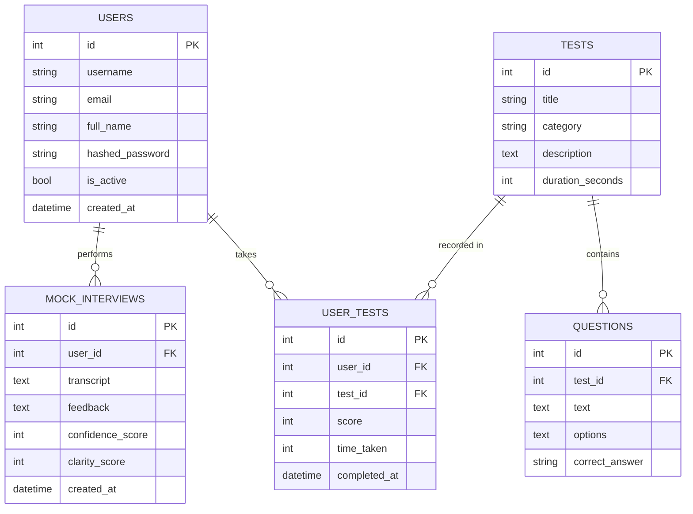

# SSB Practice Platform - System Documentation

## Project Overview
The **SSB Practice Platform** is a comprehensive tool designed to help candidates prepare for the Services Selection Board (SSB) interviews. It provides simulations for various stages of the testing process, including intelligence tests, psychological tests, and mock interviews.

### Tech Stack
- **Frontend**: React.js (Vite), Tailwind CSS
- **Backend**: FastAPI (Python), SQLAlchemy
- **Database**: SQLite (Development) / PostgreSQL (Production ready)
- **AI Integration**: Google Gemini API (for Mock Interview feedback)
- **Deployment**: Docker, Docker Compose

---

## Use Case Diagram
The following diagram illustrates the primary interactions between the User and the System.

```mermaid
usecaseDiagram
    actor "Candidate/User" as U
    actor "AI Agent" as AI

    package "SSB Practice Platform" {
        usecase "User Authentication (Login/Signup)" as UC1
        usecase "Take Psych Tests (WAT, SRT, TAT)" as UC2
        usecase "Take OIR/PPDT Tests" as UC3
        usecase "Participate in Mock Interview" as UC4
        usecase "View Performance Dashboard" as UC5
        usecase "Interact with Chatbot" as UC6
        usecase "Explore GTO Simulations" as UC7
    }

    U --> UC1
    U --> UC2
    U --> UC3
    U --> UC4
    U --> UC5
    U --> UC6
    U --> UC7

    UC4 ..> AI : "Generates Feedback"
    UC6 ..> AI : "Natural Language Response"
```

---

## Entity Relationship (ER) Diagram
The database schema is designed to track user progress, test scores, and interview performance.



---

## Database Dictionary

### Table: `users`
| Column | Type | Constraints | Description |
| :--- | :--- | :--- | :--- |
| `id` | Integer | Primary Key | Unique identifier for each user |
| `username` | String(150) | Unique, Not Null | User's unique login name |
| `email` | String(255) | Unique | User's email address |
| `full_name` | String(255) | - | User's display name |
| `hashed_password`| String(255) | Not Null | Securely stored password |
| `is_active` | Boolean | Default: True | Account status |
| `created_at` | DateTime | Default: Now | Account creation timestamp |

### Table: `tests`
| Column | Type | Constraints | Description |
| :--- | :--- | :--- | :--- |
| `id` | Integer | Primary Key | Unique identifier for each test type |
| `title` | String(255) | Not Null | Name of the test (e.g., "OIR Set 1") |
| `category` | String(50) | Not Null | Test category (OIR, PPDT, WAT, SRT) |
| `description` | Text | - | Detailed description of the test |
| `duration_seconds`| Integer | Default: 600 | Allocated time for the test |

### Table: `questions`
| Column | Type | Constraints | Description |
| :--- | :--- | :--- | :--- |
| `id` | Integer | Primary Key | Unique identifier for the question |
| `test_id` | Integer | Foreign Key | Link to the `tests` table |
| `text` | Text | Not Null | The actual question content |
| `options` | Text | Default: "[]" | JSON-encoded list of multiple-choice options |
| `correct_answer` | String(255) | - | The right answer reference |

### Table: `user_tests` (Results)
| Column | Type | Constraints | Description |
| :--- | :--- | :--- | :--- |
| `id` | Integer | Primary Key | Unique identifier for the result entry |
| `user_id` | Integer | Foreign Key | Link to the user who took the test |
| `test_id` | Integer | Foreign Key | Link to the test taken |
| `score` | Integer | - | Marks obtained by the user |
| `time_taken` | Integer | - | Time spent in seconds |
| `completed_at` | DateTime | Default: Now | When the test was finished |

### Table: `mock_interviews`
| Column | Type | Constraints | Description |
| :--- | :--- | :--- | :--- |
| `id` | Integer | Primary Key | Unique identifier for the interview session |
| `user_id` | Integer | Foreign Key | Link to the user |
| `transcript` | Text | - | Full text of the conversation |
| `feedback` | Text | - | AI-generated feedback and suggestions |
| `confidence_score`| Integer | - | Score based on user's tone/response |
| `clarity_score` | Integer | - | Score based on structure of answers |
| `created_at` | DateTime | Default: Now | Date of the interview |

---

## Important Use Cases Detail

### 1. AI-Driven Mock Interview
The system uses the Gemini API to simulate an interviewer. It captures user input, provides real-time feedback, and scores the candidate on essential qualities like confidence and clarity.

### 2. Psychological Testing (WAT/SRT)
Automated testing modules for Word Association (WAT) and Situation Reaction (SRT), providing a platform for candidates to practice within time limits.

### 3. Progressive Dashboard
Tracks user performance across different tests, allowing candidates to visualize their improvement over time and identify weak areas.
